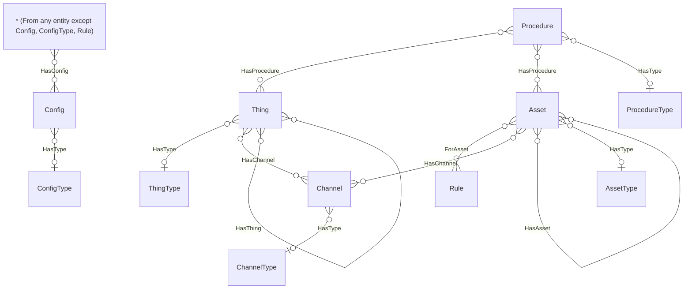

# iotdatamodel

Generic data model for Internet of Things

```mermaid
erDiagram
  Thing }o--o| ThingType : HasType
  Procedure }o--o{ Thing : HasProcedure
  Thing }o--o{ Channel : HasChannel
  Thing }o--o{ Thing : HasThing
  Procedure }o--o{ Asset : HasProcedure
  Asset }o--o{ Rule : ForAsset
  Asset }o--o{ Channel : HasChannel
  Asset }o--o{ Asset : HasAsset

  Procedure }o--o| ProcedureType : HasType
  Channel }o--o| ChannelType : HasType
  Asset }o--o| AssetType : HasType


  "* (From any entity except Config, ConfigType, Rule)" }o--o{ Config : HasConfig
  Config }o--o| ConfigType : HasType
```
